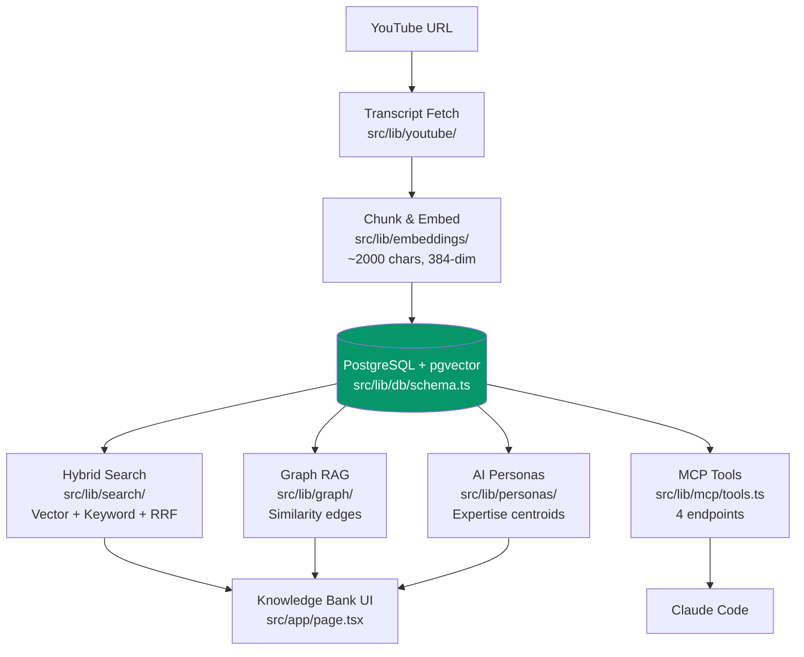

<div align="center">

# Sluice

Transform YouTube content into a searchable knowledge bank with AI-powered personas and Claude Code integration

<!-- TODO: Add hero banner image -->


</div>

---

**What happens when you point Claude Code at 200 YouTube videos?**

```
> search_rag("React Server Components best practices")

[1] (score: 0.032) "The Primeagen" — RSC Deep Dive
"The key thing people miss is that Server Components aren't about
performance — they're about data access patterns. You move the
data fetching to where the data lives..."

[2] (score: 0.029) "Theo" — Why I Changed My Mind on RSC
"Once you stop thinking of them as 'components that run on the
server' and start thinking 'components that have direct database
access,' the architecture clicks..."

[3] (score: 0.027) "Jack Herrington" — RSC Patterns That Actually Work
"The mistake is reaching for 'use client' too early. Start server,
push client boundaries down, and you'll be surprised how little
client JS you actually need..."
```

Sluice transforms YouTube videos into a searchable, AI-augmented knowledge bank. Paste a URL, get the transcript chunked and embedded, then search across hundreds of videos with hybrid RAG. AI personas capture each creator's expertise so you can query channels as if talking to the creator. The entire knowledge bank is exposed to Claude Code via MCP, turning your video library into a queryable context source for coding sessions.

---

## What It Does

### YouTube Ingestion

Paste any YouTube URL and Sluice automatically fetches the transcript, pulls metadata via oEmbed (thumbnail, title, channel, duration), and stores everything in PostgreSQL. Alternatively, upload plain text transcripts for non-YouTube content. Transcripts are chunked into ~2000-character segments with 100-character overlap (see [`src/lib/embeddings/chunker.ts`](src/lib/embeddings/chunker.ts)) and embedded locally using the all-MiniLM-L6-v2 model — 384-dimensional vectors generated entirely on your machine via ONNX runtime. No data leaves your machine during ingestion.

A database-backed job queue (see [`src/lib/automation/`](src/lib/automation/)) handles async processing with automatic retry logic (max 3 attempts, exponential backoff), so ingestion is reliable even for large batches.

### Hybrid RAG Search

Search combines three techniques into a single query pipeline (see [`src/lib/search/hybrid-search.ts`](src/lib/search/hybrid-search.ts)):

1. **Vector search** — cosine similarity on 384-dim embeddings via pgvector (`<=>` operator), catches semantic matches ("database optimization" finds "query performance tuning")
2. **Keyword search** — PostgreSQL case-insensitive `ILIKE` matching, catches exact terms that embeddings miss ("pgvector 0.7.0")
3. **Reciprocal Rank Fusion (RRF)** — combines both result sets with the formula `score = 1/(k + rank)` where k=60, naturally boosting results that appear in both lists

Results are aggregated by video (see [`src/lib/search/aggregate.ts`](src/lib/search/aggregate.ts)) — each video's score is its highest-scoring chunk, with one chunk preview per video for clean scanning. Optional temporal decay boosts recent content using a configurable half-life (default: 365 days).

### Graph RAG

Every video's chunks are compared against all chunks in the knowledge bank using pgvector cosine similarity (see [`src/lib/graph/compute-relationships.ts`](src/lib/graph/compute-relationships.ts)). Chunk pairs with similarity above 0.75 become bidirectional edges in a knowledge graph stored in the `relationships` table. This enables cross-video discovery: "Show me content related to this video" traverses the graph to find conceptually similar passages from other creators, even if they use different terminology.

### AI Insights

Claude analyzes each video to extract structured insights (see [`src/lib/claude/prompts/`](src/lib/claude/prompts/)): content type classification (dev/meeting/educational/thought-leadership/general), multi-level summary, timestamped key insights, action items, knowledge transfer prompts, and Claude Code plugin suggestions. Results are stored as JSONB in the `insights` table and displayed in the Insights tab on each video detail page.

### Creator Personas

When a channel reaches 30+ videos in your knowledge bank, Sluice suggests creating an AI persona (see [`src/lib/personas/`](src/lib/personas/)). The persona builder sends all channel transcripts to Claude for analysis, generating a system prompt that captures the creator's communication style and expertise. An expertise embedding (the centroid of all chunk embeddings for that channel) enables "Who's best?" routing — cosine similarity between your question and each persona's centroid determines which persona is most relevant.

### Ensemble Queries ("Ask the Panel")

Ask a question and get parallel streaming responses from the top 3 most relevant personas simultaneously (see [`src/lib/personas/ensemble.ts`](src/lib/personas/ensemble.ts)). Responses stream via Server-Sent Events, and each persona's answer is independently grounded in their own channel's content via RAG search. The result feels like consulting a panel of experts, each speaking from their domain.

### MCP Integration

Your entire knowledge bank is exposed to Claude Code via 4 MCP tools (see [`src/lib/mcp/tools.ts`](src/lib/mcp/tools.ts)). Search the knowledge base, list all creators, chat with a specific persona, or run ensemble queries — all accessible from your terminal during coding sessions.

### Channel Discovery

Follow YouTube channels via RSS feeds with delta detection (see [`src/app/api/cron/`](src/app/api/cron/)). Sluice automatically detects new videos as they're published. The Similar Creators feature uses average centroid similarity (0.6 threshold) to recommend related channels. Discovery tiles show new content with horizontal scroll and CSS scroll-snap.

### Focus Areas

User-defined categories let you organize videos by topic (e.g., "TypeScript", "Design Systems", "DevOps"). Filter the entire knowledge bank or search results by focus area. Focus areas persist in localStorage and sync across sessions.

---

## What You Can Do With It

### Search across your entire video library

```
> search_rag("database indexing strategies")

[1] (score: 0.032) "Hussein Nasser" — PostgreSQL Index Types Explained
"B-tree indexes are your default, but for full-text search you
want GIN indexes. And if you're doing vector similarity — that's
where pgvector's HNSW index type comes in..."

[2] (score: 0.028) "Fireship" — 7 Database Paradigms
"The key insight is that every index is a tradeoff — you're trading
write speed for read speed. The question is always: what queries
does your app actually run?"
```

Hybrid search catches both semantic meaning and exact terms. "Database optimization" finds chunks about "query performance tuning" (vector match) AND chunks that literally contain "database" (keyword match).

### Ask a creator persona a question

```
> chat_with_persona("ThePrimeagen", "Should I use Rust for my CLI tool?")

{
  "persona": "ThePrimeagen",
  "answer": "Look, if you're building a CLI tool and you already know TypeScript,
just use Bun or Deno. Seriously. Rust is amazing but the compile times and borrow
checker will slow you down for something that doesn't need to be blazing fast.
Save Rust for when you actually need zero-cost abstractions — like a language
server or a build tool.",
  "sources": [
    { "videoTitle": "Rust vs TypeScript for CLI Tools", "content": "When I built my first CLI in Rust I spent 3 hours fighting the borrow checker..." },
    { "videoTitle": "Why I Use TypeScript for Everything", "content": "The DX of TypeScript tooling is just unmatched right now..." }
  ]
}
```

The persona responds in the creator's voice, grounded in their actual content via RAG. Sources cite the specific videos used to generate the response.

### Consult the panel of experts

```
> ensemble_query("What's the future of web frameworks?")

{
  "bestMatch": { "persona": "Theo", "score": 0.89 },
  "responses": [
    {
      "persona": "Theo",
      "answer": "Server components won. The question now is whether the React ecosystem or something like Solid catches the next wave..."
    },
    {
      "persona": "ThePrimeagen",
      "answer": "HTMX proved that most apps don't need a framework at all. The pendulum is swinging back to the server..."
    },
    {
      "persona": "Fireship",
      "answer": "In 100 seconds: the future is hybrid. Server-first with islands of interactivity. Astro got this right early..."
    }
  ]
}
```

"Who's best?" routing selects the top 3 personas by expertise similarity. All 3 respond in parallel via SSE streaming, each independently grounded in their own content.

---

## Quick Start

### 1. Clone the repository

```bash
git clone https://github.com/yourusername/gold-miner.git
cd gold-miner
```

### 2. Start PostgreSQL with pgvector

```bash
docker compose up -d
```

This starts a PostgreSQL 16 container with pgvector pre-enabled:
- **Host:** `localhost:5432`
- **Database/User/Password:** `goldminer` / `goldminer` / `goldminer`
- **pgvector:** Auto-enabled via `scripts/init-db.sql`

### 3. Configure environment

```bash
cp .env.example .env
```

The defaults work for local development with Docker. The only variable you might want to add is `AI_GATEWAY_KEY` for AI features (insights, personas, ensemble queries). Without it, you can still ingest videos, generate embeddings, and search — all AI features are optional. Get a key at [console.anthropic.com](https://console.anthropic.com/).

### 4. Install dependencies and initialize the database

```bash
npm install
npm run db:push
```

Drizzle ORM creates all tables with proper indexes, foreign keys, and cascade deletes. No manual SQL needed.

### 5. Start the development servers

```bash
npm run dev
```

This starts two servers in parallel:
- **Next.js** on [http://localhost:3001](http://localhost:3001) — UI and API routes
- **Agent WebSocket** on port `9334` — Claude Agent SDK communication

Open [http://localhost:3001](http://localhost:3001) and start adding YouTube videos.

**Prerequisites:** Node.js 20+, Docker, npm. See [Getting Started](docs/getting-started.md) for the full walkthrough with troubleshooting.

---

## MCP Integration

Add Sluice to your Claude Code MCP configuration:

**Project-level** (`.mcp.json` in project root):
```json
{
  "mcpServers": {
    "sluice": {
      "type": "sse",
      "url": "http://localhost:3001/api/mcp/sse"
    }
  }
}
```

**User-level** (global, available in all projects):
```bash
claude mcp add -s user sluice --type sse --url http://localhost:3001/api/mcp/sse
```

| Tool | What It Does |
|------|-------------|
| `search_rag` | Hybrid search with vector + keyword + RRF fusion, optional creator filtering and result limit |
| `get_list_of_creators` | List all channels in your knowledge bank with video counts |
| `chat_with_persona` | Query a specific creator persona with RAG-grounded responses and source citations |
| `ensemble_query` | Ask multiple personas simultaneously, get top 3 parallel responses with "who's best" routing |

See [MCP Tools Reference](docs/mcp-tools.md) for complete parameter specs and example outputs.

---

## Architecture



The pipeline flows from YouTube URL ingestion through transcript fetching, then splits into ~2000-character chunks with 100-character overlap. The all-MiniLM-L6-v2 model (via `@huggingface/transformers` ONNX runtime) generates 384-dimensional vectors stored in PostgreSQL with pgvector. From there, content is accessible via four paths: hybrid search (vector + keyword + RRF fusion), Graph RAG (similarity edges for cross-video discovery), AI personas (channel expertise models with centroid-based routing), and MCP tools (exposing the full knowledge bank to Claude Code).

See [Core Concepts](docs/core-concepts.md) for the full architecture explanation with detailed mermaid diagrams.

---

## What Stays Local vs. What Uses the API

| Local (no API calls, no billing) | Uses Claude API (requires `AI_GATEWAY_KEY`) |
|----------------------------------|---------------------------------------------|
| Transcript fetching from YouTube | `Generate Insights` — structured extraction per video |
| Chunking transcripts into segments | `Create Persona` — channel expertise model generation |
| Embedding generation (ONNX, local) | `Chat with Persona` — RAG-grounded persona response |
| Hybrid search (vector + keyword + RRF) | `Ensemble Query` — multi-persona streaming responses |
| Graph RAG traversal and relationship computation | |
| Channel RSS feed monitoring and delta detection | |
| MCP tool serving to Claude Code | |
| Focus area management and filtering | |

Embeddings are generated locally using the all-MiniLM-L6-v2 ONNX model (~23MB, downloads once to `/tmp/.cache`). No video content or transcript data is sent to any external API during ingestion or search. The Claude API is only called for AI features that explicitly generate new content (insights, personas, ensemble queries).

---

## Documentation

| Doc | What's In It |
|-----|-------------|
| [Getting Started](docs/getting-started.md) | Full setup walkthrough — prerequisites, step-by-step with explanations, first steps, troubleshooting |
| [Core Concepts](docs/core-concepts.md) | Architecture deep dive — ingestion pipeline, chunking, hybrid search, RRF, Graph RAG, personas, ensemble queries, database schema, automation |
| [MCP Tools Reference](docs/mcp-tools.md) | Every MCP tool with parameter tables, example inputs/outputs, tips, and authentication |
| [Search Guide](docs/search-guide.md) | Search modes comparison, API parameters, scoring mechanics, and tips for effective searching |
| [Deployment](DEPLOY.md) | Production deployment to Vercel + Neon PostgreSQL |
| [Contributing](CONTRIBUTING.md) | Setup, code style, testing guidelines, and PR process |
| [CLAUDE.md](CLAUDE.md) | Developer reference — code conventions, API patterns, architecture details (project instructions for AI tools) |

---

## Tech Stack

| Category | Technology |
|----------|-----------|
| **Framework** | [Next.js 16](https://nextjs.org/) (App Router) with [React 19](https://react.dev/) |
| **Language** | [TypeScript](https://www.typescriptlang.org/) (strict mode) |
| **Database** | [PostgreSQL 16](https://www.postgresql.org/) + [pgvector](https://github.com/pgvector/pgvector) via [Drizzle ORM](https://orm.drizzle.team/) |
| **Styling** | [Tailwind CSS v4](https://tailwindcss.com/) + [shadcn/ui](https://ui.shadcn.com/) |
| **Embeddings** | [all-MiniLM-L6-v2](https://huggingface.co/Xenova/all-MiniLM-L6-v2) via [@huggingface/transformers](https://github.com/huggingface/transformers.js) (local ONNX) |
| **AI** | [Claude API](https://www.anthropic.com/claude) (Sonnet 4) for insights and personas |
| **MCP** | [@modelcontextprotocol/sdk](https://github.com/modelcontextprotocol/typescript-sdk) |
| **Testing** | [Vitest](https://vitest.dev/) + [React Testing Library](https://testing-library.com/) |

---

## License

[MIT](LICENSE) © 2026 DevObsessed

---

**Built with [Claude Code](https://claude.ai/claude-code) and inspired by the power of connecting knowledge across conversations.**
