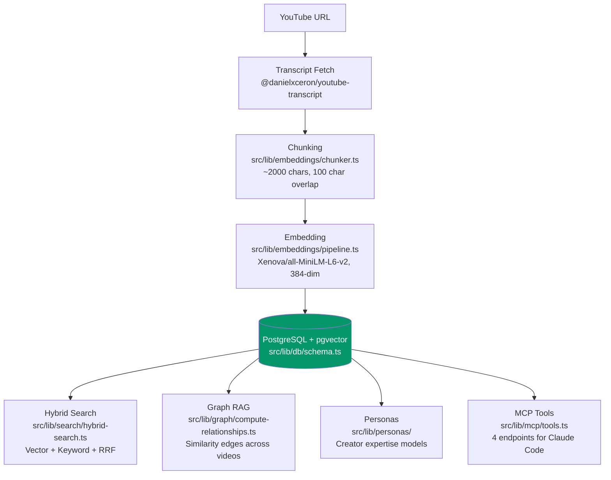
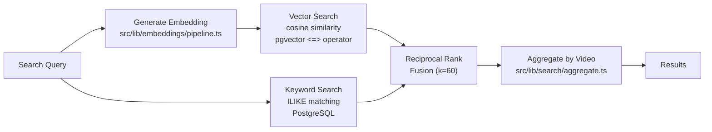
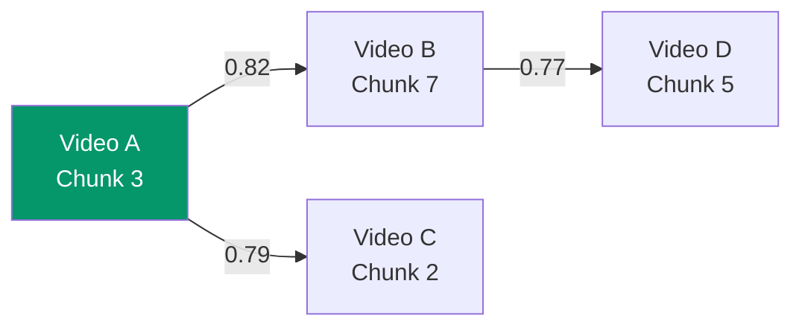
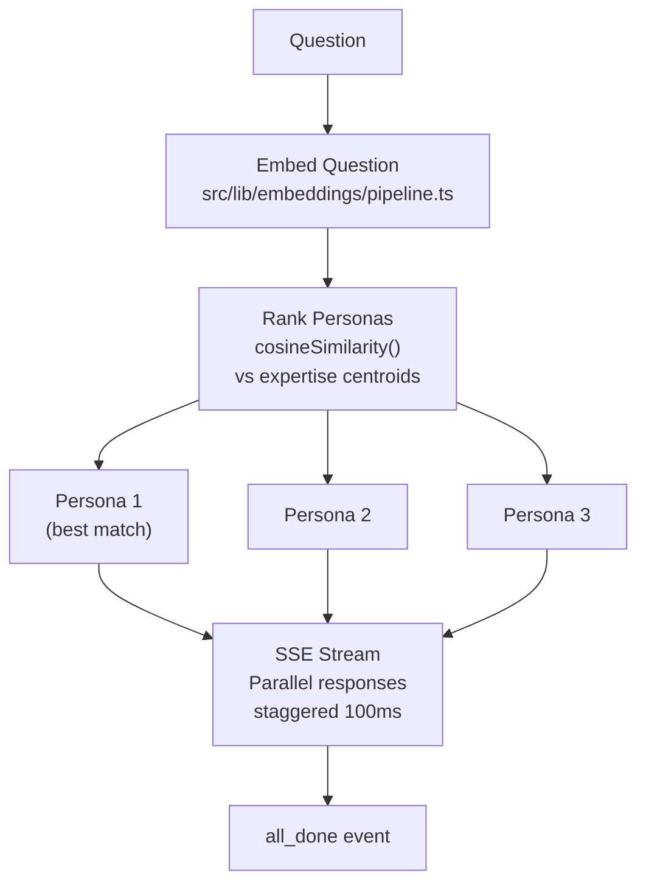

# Core Concepts

How Sluice transforms YouTube videos into a searchable knowledge bank. This guide covers every major system with mermaid diagrams and source file references so you can understand the architecture and find the code.

---

## The Pipeline

Every video flows through the same pipeline: ingest, chunk, embed, store. From there, content is accessible via four paths: search, graph traversal, personas, and MCP tools.



---

## Ingestion

### Transcript Fetching

Sluice fetches transcripts using the `@danielxceron/youtube-transcript` library (see [`src/lib/youtube/`](../src/lib/youtube/)). For videos without available transcripts, users can paste raw text via the Add Transcript page (`/add-transcript`). Both paths produce the same result: text stored in the `videos` table with metadata (title, channel, thumbnail, duration, published date).

Video metadata is fetched via YouTube's oEmbed API — a lightweight approach that doesn't require API keys.

### Chunking

Source: [`src/lib/embeddings/chunker.ts`](../src/lib/embeddings/chunker.ts)

Transcripts are split into chunks with these constants:

```typescript
export const TARGET_CHUNK_SIZE = 2000  // characters (~300 words)
export const CHUNK_OVERLAP = 100       // characters of overlap between consecutive chunks
```

The chunking algorithm:

1. Walks through transcript segments sequentially
2. Accumulates text until reaching `TARGET_CHUNK_SIZE` (2000 characters)
3. When a chunk would exceed the target, finalizes the current chunk
4. For long segments exceeding the target, splits at sentence boundaries (`.`, `!`, `?`) when possible
5. Falls back to word boundaries if no sentence break is found within range
6. Carries `CHUNK_OVERLAP` (100 characters) from the end of each chunk into the start of the next for context continuity

Each chunk preserves the start and end timestamps from the original transcript segments, enabling time-linked navigation in the UI.

### Embedding

Source: [`src/lib/embeddings/pipeline.ts`](../src/lib/embeddings/pipeline.ts)

Chunks are embedded using the [Xenova/all-MiniLM-L6-v2](https://huggingface.co/Xenova/all-MiniLM-L6-v2) model via `@huggingface/transformers` (ONNX runtime). This runs **entirely locally** — no API calls, no data sent anywhere.

| Property | Value |
|----------|-------|
| **Model** | `Xenova/all-MiniLM-L6-v2` |
| **Dimensions** | 384 |
| **Pooling** | Mean pooling with L2 normalization |
| **Runtime** | ONNX via `@huggingface/transformers` (runs in Node.js, no GPU required) |
| **Cache directory** | `/tmp/.cache` (configured for Vercel compatibility) |
| **Cold start** | ~10-15 seconds on first use (downloads ~23MB model) |
| **Subsequent calls** | <100ms per chunk (model cached as singleton in memory) |

The `EmbeddingPipeline` class is a singleton — the model loads once and stays in memory across requests. It automatically detects and recovers from corrupted model cache by clearing `/tmp/.cache/Xenova/all-MiniLM-L6-v2` and retrying once.

### Embedding Service

Source: [`src/lib/embeddings/service.ts`](../src/lib/embeddings/service.ts)

The embedding service handles batch processing:
- **Batch size:** 32 chunks per batch for optimal throughput
- **Progress callback:** Reports after each batch (used by UI progress indicators)
- **Error handling:** Continues on per-chunk failure (doesn't abort the whole batch)
- **Transaction-based storage:** Deletes old chunks and inserts new ones atomically
- **Timestamps:** Stored in seconds (converted from millisecond transcript offsets)

---

## Search

Sluice supports three search modes. **Hybrid** (the default) is almost always what you want.

Source: [`src/lib/search/hybrid-search.ts`](../src/lib/search/hybrid-search.ts)

### Hybrid Search (Default)

Combines vector similarity and keyword matching using **Reciprocal Rank Fusion (RRF)**:



**Step 1 — Vector search** (see [`src/lib/search/vector-search.ts`](../src/lib/search/vector-search.ts)):

Embeds the query into a 384-dim vector, then finds chunks with highest cosine similarity using pgvector's `<=>` operator. The similarity formula converts cosine distance to a 0-1 score: `similarity = 1 - (distance / 2)`. Results below a 0.3 similarity threshold are filtered out. Catches semantic matches — "database optimization" finds chunks about "query performance tuning."

**Step 2 — Keyword search:**

PostgreSQL case-insensitive `ILIKE` matching on chunk content. All matches get a score of 1.0 (binary match/no-match). Catches exact terms that vector search might miss — "pgvector" as a specific technology name, or "bun 1.2" as a version reference.

**Step 3 — RRF fusion:**

Each result gets a score based on its rank in each list:

```
rrfScore = 1 / (k + rank + 1)    where k = 60, rank is 0-indexed
```

Results appearing in both lists get their scores summed. The constant k=60 prevents any single high-ranked result from dominating. In hybrid mode, `limit * 2` results are fetched from each method before fusion to ensure diverse candidates.

**Step 4 — Video aggregation** (see [`src/lib/search/aggregate.ts`](../src/lib/search/aggregate.ts)):

Chunk results are grouped by video. Each video's score is its highest-scoring chunk (`max` aggregation). The `bestChunk` contains the content and timestamp of the top-scoring chunk. The `matchedChunks` count tells how many chunks from that video matched. The UI shows one chunk preview per video for clean scanning.

### Temporal Decay (Optional)

Source: [`src/lib/temporal/decay.ts`](../src/lib/temporal/decay.ts)

When enabled (`temporalDecay=true`), search results are weighted by publication date. The decay function uses a configurable half-life:

```
decayedScore = originalScore * 2^(-daysSincePublished / halfLifeDays)
```

Default half-life is 365 days — after one year, a result's score drops to 50% of its original value. Useful for topics where freshness matters (framework versions, evolving best practices).

### Focus Area Filtering

Results can be filtered by user-defined focus areas (categories like "TypeScript", "DevOps"). The filter runs after search via the `video_focus_areas` junction table — only videos assigned to the chosen focus area are included in results.

---

## Graph RAG

Source: [`src/lib/graph/compute-relationships.ts`](../src/lib/graph/compute-relationships.ts)

Every video's chunks are compared against **all** chunks in the knowledge bank using pgvector's `<=>` cosine distance operator directly in SQL. Chunk pairs with similarity above **0.75** (the default threshold) become bidirectional edges in a knowledge graph.



The relationship computation:
1. Uses SQL `CROSS JOIN` with pgvector `<=>` to find all chunk pairs above the threshold
2. Creates **bidirectional** edges (A→B and B→A) for graph traversal
3. Handles duplicates gracefully with `onConflictDoNothing`
4. Stores edges in the `relationships` table with similarity scores

This enables cross-video discovery: when you view a video, the UI can show conceptually similar passages from other creators, even if they use different terminology.

---

## Personas

Source: [`src/lib/personas/`](../src/lib/personas/)

### How Personas Are Built

When a channel reaches **30+ videos** in your knowledge bank, Sluice suggests creating a persona. The persona builder:

1. Collects all transcripts from the channel
2. Sends them to Claude (Sonnet 4) for analysis
3. Claude generates a **system prompt** capturing the creator's communication style, expertise areas, and perspectives
4. Computes an **expertise embedding** — the centroid (average) of all chunk embeddings for that channel
5. Stores the persona in the `personas` table with the system prompt, expertise topics (as JSONB), and the 384-dim expertise embedding

The system prompt becomes the persona's "voice." The expertise embedding becomes its "knowledge area."

### Querying Personas

Source: [`src/lib/personas/context.ts`](../src/lib/personas/context.ts)

When you chat with a persona:

1. `getPersonaContext()` searches that creator's chunks for content relevant to your question (RAG)
2. `formatContextForPrompt()` formats the matched chunks into the prompt
3. The enriched system prompt (persona voice + relevant content) is sent to Claude
4. Claude responds in the creator's voice, grounded in their actual content

### Ensemble Queries ("Ask the Panel")

Source: [`src/lib/personas/ensemble.ts`](../src/lib/personas/ensemble.ts)

Ensemble mode queries multiple personas simultaneously:



How "Who's best?" routing works:

1. `findBestPersonas()` embeds your question into a 384-dim vector
2. Computes cosine similarity (via `cosineSimilarity()` from `compute-relationships.ts`) against each persona's expertise centroid
3. Selects the top 3 personas by similarity score
4. `streamEnsembleResponse()` creates a single `ReadableStream` that merges all persona responses
5. Persona streams are staggered by 100ms to avoid API rate limits
6. Each response is independently grounded in that creator's content via `getPersonaContext()`

**SSE event flow:**
1. `best_match` — Top persona by similarity score
2. `persona_start` (x N) — One per persona
3. `delta` (x many) — Persona-tagged text chunks
4. `sources` (x N) — Context chunks used per persona
5. `persona_done` (x N) — One per persona completion
6. `persona_error` (if failures) — Per failed persona
7. `all_done` — Final event (always emitted, even for empty results)

---

## Database Schema

Source: [`src/lib/db/schema.ts`](../src/lib/db/schema.ts)

Sluice uses PostgreSQL with the pgvector extension. The schema has three groups of tables:

### Application Tables (12)

| Table | Purpose | Key Columns |
|-------|---------|-------------|
| `videos` | Video metadata and transcripts | `source_type`, `youtube_id`, `title`, `channel`, `transcript`, `published_at` |
| `chunks` | Transcript chunks with vector embeddings | `video_id`, `content`, `start_time`, `end_time`, `embedding` (384-dim) |
| `insights` | AI extraction results | `video_id` (unique), `content_type`, `extraction` (JSONB) |
| `relationships` | Graph RAG chunk-to-chunk edges | `source_chunk_id`, `target_chunk_id`, `similarity` |
| `temporal_metadata` | Version mentions for temporal decay | `chunk_id`, `version_mention`, `confidence` |
| `channels` | Followed YouTube channels | `channel_id`, `name`, `feed_url`, `auto_fetch`, `fetch_interval_hours` |
| `discovery_videos` | Cached RSS feed videos | `youtube_id`, `channel_id`, `channel_name`, `published_at` |
| `personas` | AI-generated personas | `channel_name`, `name`, `system_prompt`, `expertise_embedding` (384-dim) |
| `focus_areas` | User-defined categories | `name`, `color` |
| `video_focus_areas` | Many-to-many junction | `video_id`, `focus_area_id` |
| `jobs` | Database-backed job queue | `type`, `payload` (JSONB), `status`, `attempts`, `max_attempts` |
| `settings` | Key-value store | `key`, `value` |

### Authentication Tables (managed by Better Auth)

| Table | Purpose |
|-------|---------|
| `user` | User accounts |
| `session` | Active sessions |
| `account` | OAuth provider accounts |
| `verification` | Email verification tokens |

### OAuth Tables (managed by Better Auth MCP plugin)

| Table | Purpose |
|-------|---------|
| `oauth_application` | Registered OAuth applications |
| `oauth_access_token` | OAuth access and refresh tokens |
| `oauth_consent` | User consent records |

**Design conventions:**
- Application tables use auto-incrementing `serial` primary keys
- Auth/OAuth tables use `text` IDs (UUIDs)
- Foreign keys use `onDelete: 'cascade'` for cleanup
- Indexes on commonly queried columns (`chunks.video_id`, `jobs.status`, `relationships.source_chunk_id`)
- Unique constraints where appropriate (`videos.youtube_id`, `channels.channel_id`, `personas.channel_name`)

---

## Automation

### Job Queue

Source: [`src/lib/automation/`](../src/lib/automation/)

Sluice uses a database-backed job queue for reliable async processing:

| Property | Value |
|----------|-------|
| **Job types** | `fetch_transcript`, `generate_embeddings`, `generate_insights` |
| **Max attempts** | 3 (with exponential backoff) |
| **Status flow** | `pending` → `processing` → `completed` / `failed` |
| **Storage** | `jobs` table with JSONB payload |

When you add a video, the embedding generation is queued as a job. The job processor picks it up, generates embeddings, and updates the job status.

### Channel Monitoring

Source: [`vercel.json`](../vercel.json) and [`src/app/api/cron/`](../src/app/api/cron/)

When you follow a YouTube channel, Sluice monitors its RSS feed for new videos. Two cron jobs handle this:

| Job | Schedule | Path | Purpose |
|-----|----------|------|---------|
| `check-feeds` | Every 12 hours | `/api/cron/check-feeds` | Polls RSS feeds, detects new videos via delta comparison, queues transcript fetches |
| `process-jobs` | Every 5 minutes | `/api/cron/process-jobs` | Processes queued jobs (transcript fetch, embedding generation, insights) |

In production (Vercel), these run as Vercel Cron Jobs authenticated with `CRON_SECRET`. Locally, you can trigger them manually via curl.

---

## Dual Transport Agent

Source: [`src/agent/`](../src/agent/)

Sluice supports two transport mechanisms for AI agent operations:

| Transport | Environment | How It Works |
|-----------|-------------|-------------|
| **WebSocket** | Local dev | Standalone server via `npm run agent` on port 9334, token from `.agent-token` file |
| **SSE** | Production | Server-Sent Events via `/api/agent/stream`, token from `AGENT_AUTH_TOKEN` env var |

The transport is auto-detected: the `/api/agent/token` endpoint returns `transport: 'websocket'` (local) or `transport: 'sse'` (production) based on whether `AGENT_AUTH_TOKEN` is set. The `AgentConnection` class abstracts both transports with the same public API, so UI components (`ExtractionProvider`, `InsightsTabs`, `InsightsPanel`) work identically across environments.

---

## Further Reading

- **[Getting Started](getting-started.md)** — Setup walkthrough
- **[MCP Tools Reference](mcp-tools.md)** — Complete tool documentation
- **[Search Guide](search-guide.md)** — Search tips and mode comparison
- **[CLAUDE.md](../CLAUDE.md)** — Developer reference (code style, API conventions, architecture details)
- **[DEPLOY.md](../DEPLOY.md)** — Production deployment to Vercel + Neon
